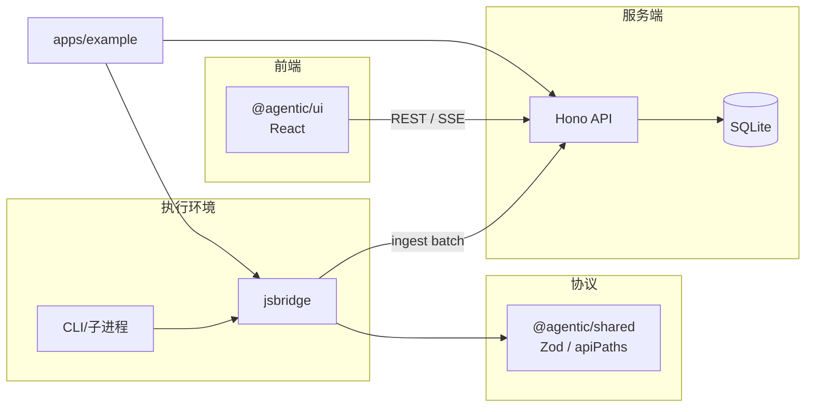

# 架构

整体为 **Node.js + TypeScript** monorepo，核心分为 **协议层、采集上报、存储与 API、展示层**，外加 **示例应用**。

## 模块关系

- **shared**：定义事件 envelope、ingest 请求体等，供 jsbridge、server、（可选）UI 类型对齐。
- **jsbridge**：在执行侧构造符合协议的事件并调用 `POST /v1/ingest/batch`；Provider 包装负责从 DeepSeek / Claude Code 等场景中采集。
- **server**：校验与落库，提供 Run 列表、事件时间线、SSE 等接口。
- **ui**：连接同一 API，展示 Run 与按 `agentId` 等维度过滤的时间线。
- **example**：演示伪造事件与使用子进程包装，便于本地联调 UI。

## 数据流（简述）

1. 一次 agent 运行对应一个 **runId**；同一 Run 下可有多个 **agentId**（多 agent）。
2. 事件带单调 **seq**（等字段见 `packages/shared/src/schema.ts`），server 持久化后 UI 可按序展示或增量拉取 / SSE 订阅。
