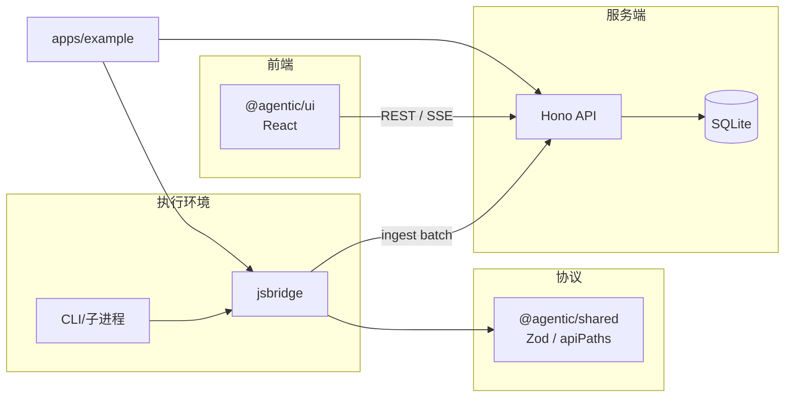
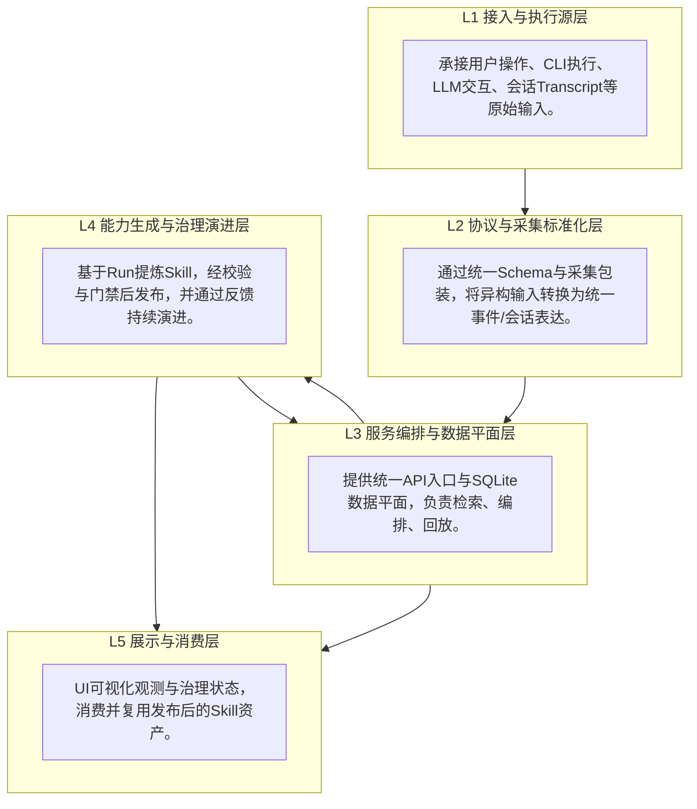

# 架构

整体为 **Node.js + TypeScript** monorepo，核心分为 **协议层、采集上报、存储与 API、展示层**，外加 **示例应用**。

## 模块关系

- **shared**：定义事件 envelope、ingest 请求体等，供 jsbridge、server、（可选）UI 类型对齐。
- **jsbridge**：在执行侧构造符合协议的事件并调用 `POST /v1/ingest/batch`；Provider 包装负责从 DeepSeek / Claude Code 等场景中采集。
- **server**：校验与落库，提供 Run 列表、事件时间线、SSE 等接口。
- **ui**：连接同一 API，展示 Run 与按 `agentId` 等维度过滤的时间线。
- **example**：演示伪造事件与使用子进程包装，便于本地联调 UI。

## 数据流（简述）

1. 一次 agent 运行对应一个 **runId**；同一 Run 下可有多个 **agentId**（多 agent）。
2. 事件带单调 **seq**（等字段见 `packages/shared/src/schema.ts`），server 持久化后 UI 可按序展示或增量拉取 / SSE 订阅。

## 系统分层架构设计说明

### 分层总览

### L1 接入与执行源层

- **职责1：多源输入承接**：接收用户意图、CLI执行轨迹、LLM交互、Cursor transcript。
- **职责2：原始上下文保真**：保留任务发生时语境与顺序，避免过早抽象导致信息损失。
- **职责3：任务单元边界形成**：以会话/运行片段为采集单元，支撑 runId/sessionId 关联。
- **边界原则**：只负责原始事实输入，不承担治理判断与能力抽象。

### L2 协议与采集标准化层

- **职责1：统一数据协议**：由 `@agentic/shared` 约束 schema、类型与 API 路径。
- **职责2：异构源标准化**：由 `jsbridge` 将不同执行环境统一映射为标准事件。
- **职责3：会话结构化预处理**：通过 `distill` 与 `session->events` 提升可检索与可回放性。
- **边界原则**：只做标准化与映射，不做策略门禁与业务治理。

### L3 服务编排与数据平面层

- **职责1：统一服务入口**：由 `@agentic/server` 提供 ingest/sessions/runs/skills 等 API。
- **职责2：统一存储与查询**：SQLite 持久化 Runs/Events/Sessions/Skills/Feedback/Release。
- **职责3：链路编排中枢**：打通 `sessions sync/distill/sync-to-runs` 与 run 观测主链路。
- **边界原则**：负责事实管理与流程编排，不直接定义 skill 质量结论。

### L4 能力生成与治理演进层

- **职责1：能力提炼**：Harness 基于 run 采样，生成可复用 skill 草案。
- **职责2：质量与门禁**：经 schema 校验、策略规则、质量评估后进入 review/release。
- **职责3：闭环演进**：通过 runtime/human feedback、experiment/eval、rollback 持续迭代。
- **边界原则**：只沉淀可复用、可验证、可回滚的能力，不沉淀一次性噪声。

### L5 展示与消费层

- **职责1：全景可视化**：展示 Runs/Sessions/Skills/治理与演进状态。
- **职责2：观测驱动决策**：以趋势、评分、反馈支持发布、回滚、再生成。
- **职责3：资产化复用**：将通过治理的 Skill 作为标准能力供后续任务消费。
- **边界原则**：以展示与消费为核心，不承担底层采集与规则执行。

### 架构原则

- **先统一事实，再抽象能力；先治理发布，再规模复用；以反馈闭环驱动持续演进。**

