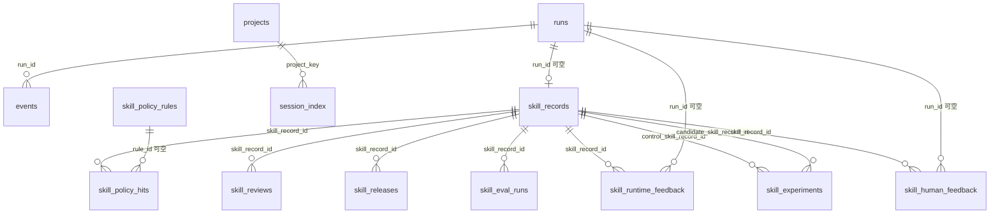
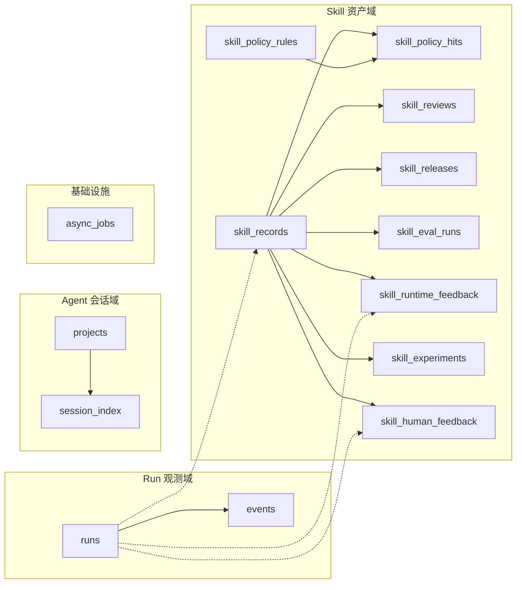

# 数据库表结构与关联

SQLite 库由 `@agentic/server` 在 `packages/server/src/db.ts` 的 `openDb` 中初始化；路径由环境变量 `AGENTIC_DB_PATH` 控制，默认 `packages/server/data/agentic.db`。已启用 `foreign_keys = ON`。

以下与源码 **当前** `openDb` 内建表及迁移追加列一致。

## 总览（ER）

`skill_records.parent_skill_record_id` 为同表版本链逻辑关联，图中略去自环以免渲染歧义。

说明：`**async_jobs**` 无外键，独立表；`**skill_records.parent_skill_record_id**` 由迁移追加，指向同表 `id` 的**逻辑**版本链，SQLite 未声明外键约束。

## 域分组示意

## 表结构明细

### `runs`

| 列               | 类型   | 约束       | 说明     |
| --------------- | ---- | -------- | ------ |
| `run_id`        | TEXT | PK       | Run 标识 |
| `created_at`    | TEXT | NOT NULL | 创建时间   |
| `last_event_at` | TEXT | NOT NULL | 最后事件时间 |

### `events`

| 列              | 类型      | 约束                           | 说明                     |
| -------------- | ------- | ---------------------------- | ---------------------- |
| `id`           | INTEGER | PK, 自增                       | 行 id                   |
| `run_id`       | TEXT    | NOT NULL, FK → `runs.run_id` | 所属 Run                 |
| `agent_id`     | TEXT    | NOT NULL                     | Agent                  |
| `seq`          | INTEGER | NOT NULL                     | 单调序号                   |
| `provider`     | TEXT    | NOT NULL                     | 提供方                    |
| `kind`         | TEXT    | NOT NULL                     | `cli` / `llm` / `meta` |
| `ts`           | TEXT    | NOT NULL                     | 事件时间                   |
| `payload_json` | TEXT    | NOT NULL                     | 负载 JSON                |

唯一约束：`UNIQUE (run_id, agent_id, seq)`。索引：`idx_events_run_seq`、`idx_events_run_agent`。

### `projects`

| 列              | 类型   | 约束       | 说明   |
| -------------- | ---- | -------- | ---- |
| `project_key`  | TEXT | PK       | 项目键  |
| `project_name` | TEXT | NOT NULL | 展示名  |
| `project_path` | TEXT | NOT NULL | 路径   |
| `created_at`   | TEXT | NOT NULL | 创建时间 |
| `updated_at`   | TEXT | NOT NULL | 更新时间 |

### `session_index`

| 列                                                 | 类型      | 约束                                    | 说明       |
| ------------------------------------------------- | ------- | ------------------------------------- | -------- |
| `id`                                              | INTEGER | PK, 自增                                | 行 id     |
| `project_key`                                     | TEXT    | NOT NULL, FK → `projects.project_key` | 项目       |
| `source_type`                                     | TEXT    | NOT NULL                              | 来源类型     |
| `source_agent_id`                                 | TEXT    | NOT NULL                              | 来源 Agent |
| `session_id`                                      | TEXT    | NOT NULL                              | 会话 id    |
| `title`                                           | TEXT    | NOT NULL                              | 标题       |
| `time_start` / `time_end`                         | TEXT    | NOT NULL                              | 时间范围     |
| `preview_excerpt`                                 | TEXT    | NOT NULL                              | 摘要       |
| `raw_ref`                                         | TEXT    | NOT NULL                              | 原始引用     |
| `content_text`                                    | TEXT    | NOT NULL                              | 正文       |
| `input_tokens` / `output_tokens` / `total_tokens` | INTEGER | NOT NULL, 默认 0                        | 迁移追加     |
| `created_at` / `updated_at`                       | TEXT    | NOT NULL                              | 时间戳      |

唯一约束：`UNIQUE (project_key, source_type, source_agent_id, session_id)`。

### `skill_records`

| 列                        | 类型      | 约束                     | 说明                                    |
| ------------------------ | ------- | ---------------------- | ------------------------------------- |
| `id`                     | INTEGER | PK, 自增                 | Skill 记录 id                           |
| `run_id`                 | TEXT    | 可空, FK → `runs.run_id` | 来源 Run                                |
| `format`                 | TEXT    | NOT NULL               | 范式，如 cursor/claude                    |
| `skill_id`               | TEXT    | NOT NULL               | 业务 skill 标识                           |
| `status`                 | TEXT    | NOT NULL               | 状态                                    |
| `files_json`             | TEXT    | NOT NULL               | 文件清单 JSON                             |
| `meta_json`              | TEXT    | 可空                     | 元数据 JSON                              |
| `created_at`             | TEXT    | NOT NULL               | 创建时间                                  |
| `version`                | INTEGER | NOT NULL, 默认 1         | 迁移追加：版本号                              |
| `parent_skill_record_id` | INTEGER | 可空                     | 迁移追加：父记录 **逻辑** 指向 `skill_records.id` |
| `change_summary`         | TEXT    | 可空                     | 迁移追加                                  |
| `feedback_snapshot_json` | TEXT    | 可空                     | 迁移追加                                  |

### `async_jobs`

| 列                           | 类型         | 说明   |
| --------------------------- | ---------- | ---- |
| `id`                        | INTEGER PK | 自增   |
| `type`                      | TEXT       | 任务类型 |
| `payload_json`              | TEXT       | 负载   |
| `status`                    | TEXT       | 状态   |
| `result_ref`                | TEXT       | 结果引用 |
| `error`                     | TEXT       | 错误信息 |
| `created_at` / `updated_at` | TEXT       | 时间戳  |

无外键。

### `skill_policy_rules`

| 列             | 类型         | 说明   |
| ------------- | ---------- | ---- |
| `id`          | INTEGER PK | 自增   |
| `name`        | TEXT       | 规则名  |
| `severity`    | TEXT       | 严重级别 |
| `scope`       | TEXT       | 作用域  |
| `config_json` | TEXT       | 可空配置 |
| `enabled`     | INTEGER    | 是否启用 |
| `created_at`  | TEXT       | 创建时间 |

### `skill_policy_hits`

| 列                 | 类型      | 约束                                |
| ----------------- | ------- | --------------------------------- |
| `id`              | INTEGER | PK                                |
| `skill_record_id` | INTEGER | NOT NULL, FK → `skill_records.id` |
| `rule_id`         | INTEGER | 可空, FK → `skill_policy_rules.id`  |
| `rule_name`       | TEXT    | NOT NULL                          |
| `severity`        | TEXT    | NOT NULL                          |
| `decision`        | TEXT    | NOT NULL                          |
| `evidence_json`   | TEXT    | 可空                                |
| `created_at`      | TEXT    | NOT NULL                          |

### `skill_reviews`

| 列                 | 类型      | 约束                                |
| ----------------- | ------- | --------------------------------- |
| `id`              | INTEGER | PK                                |
| `skill_record_id` | INTEGER | NOT NULL, FK → `skill_records.id` |
| `reviewer`        | TEXT    | NOT NULL                          |
| `decision`        | TEXT    | NOT NULL                          |
| `reason`          | TEXT    | 可空                                |
| `created_at`      | TEXT    | NOT NULL                          |

### `skill_releases`

| 列                 | 类型      | 约束                                |
| ----------------- | ------- | --------------------------------- |
| `id`              | INTEGER | PK                                |
| `skill_record_id` | INTEGER | NOT NULL, FK → `skill_records.id` |
| `channel`         | TEXT    | NOT NULL                          |
| `status`          | TEXT    | NOT NULL                          |
| `approved_by`     | TEXT    | NOT NULL                          |
| `created_at`      | TEXT    | NOT NULL                          |

### `skill_eval_runs`

| 列                 | 类型      | 约束                                |
| ----------------- | ------- | --------------------------------- |
| `id`              | INTEGER | PK                                |
| `skill_record_id` | INTEGER | NOT NULL, FK → `skill_records.id` |
| `dataset`         | TEXT    | NOT NULL                          |
| `score`           | REAL    | NOT NULL                          |
| `verdict`         | TEXT    | NOT NULL                          |
| `summary`         | TEXT    | 可空                                |
| `created_at`      | TEXT    | NOT NULL                          |

### `skill_runtime_feedback`

| 列                 | 类型      | 约束                                |
| ----------------- | ------- | --------------------------------- |
| `id`              | INTEGER | PK                                |
| `skill_record_id` | INTEGER | NOT NULL, FK → `skill_records.id` |
| `run_id`          | TEXT    | 可空, FK → `runs.run_id`            |
| `task_type`       | TEXT    | NOT NULL                          |
| `success`         | INTEGER | NOT NULL                          |
| `latency_ms`      | INTEGER | NOT NULL                          |
| `token_cost`      | REAL    | NOT NULL, 默认 0                    |
| `retry_count`     | INTEGER | NOT NULL, 默认 0                    |
| `human_takeover`  | INTEGER | NOT NULL, 默认 0                    |
| `created_at`      | TEXT    | NOT NULL                          |

### `skill_experiments`

| 列                           | 类型      | 约束                                |
| --------------------------- | ------- | --------------------------------- |
| `id`                        | INTEGER | PK                                |
| `control_skill_record_id`   | INTEGER | NOT NULL, FK → `skill_records.id` |
| `candidate_skill_record_id` | INTEGER | NOT NULL, FK → `skill_records.id` |
| `traffic_ratio`             | REAL    | NOT NULL                          |
| `status`                    | TEXT    | NOT NULL                          |
| `created_at`                | TEXT    | NOT NULL                          |

### `skill_human_feedback`

| 列                 | 类型      | 约束                                |
| ----------------- | ------- | --------------------------------- |
| `id`              | INTEGER | PK                                |
| `skill_record_id` | INTEGER | NOT NULL, FK → `skill_records.id` |
| `run_id`          | TEXT    | 可空, FK → `runs.run_id`            |
| `role`            | TEXT    | NOT NULL                          |
| `sentiment`       | TEXT    | NOT NULL                          |
| `problem_type`    | TEXT    | NOT NULL                          |
| `severity`        | TEXT    | NOT NULL                          |
| `free_text`       | TEXT    | NOT NULL                          |
| `suggestion`      | TEXT    | 可空                                |
| `created_at`      | TEXT    | NOT NULL                          |

## 关联关系小结

| 从                    | 到                                                                                                                                | 关系                                      |
| -------------------- | -------------------------------------------------------------------------------------------------------------------------------- | --------------------------------------- |
| `runs`               | `events`                                                                                                                         | 一对多；级联语义依赖应用层删除策略                       |
| `runs`               | `skill_records`                                                                                                                  | 一对多（`run_id` 可空）                        |
| `projects`           | `session_index`                                                                                                                  | 一对多                                     |
| `skill_records`      | `skill_policy_hits` / `skill_reviews` / `skill_releases` / `skill_eval_runs` / `skill_runtime_feedback` / `skill_human_feedback` | 一对多                                     |
| `skill_policy_rules` | `skill_policy_hits`                                                                                                              | 一对多（`rule_id` 可空）                       |
| `runs`               | `skill_runtime_feedback` / `skill_human_feedback`                                                                                | 可选关联（`run_id` 可空）                       |
| `skill_records`      | `skill_experiments`                                                                                                              | 同一表两行分别作对照组/候选组                         |
| `skill_records`      | `skill_records`                                                                                                                  | 版本链：`parent_skill_record_id` → `id`（逻辑） |

权威定义以仓库内 `packages/server/src/db.ts` 为准。