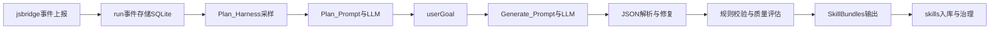

# Harness Skill 生成模块

Harness Skill 生成模块把一次 `runId` 下的观测数据（CLI、LLM、meta）经 **Plan** 提炼为 `userGoal`，再经 **Generate** 产出可复用的 **Skill 草案**，让「一次成功实践」沉淀为可治理、可版本化、可发布的能力单元。

## 概念说明

- **Harness（上下文采样器）**：在 **Plan** 步围绕某个 `runId` 收集并裁剪事件上下文，为「能力描述」模型提供稳定输入。
- **Plan**：`POST /v1/runs/:runId/skill/plan`，内置 `skillGenerateAgent`（`@agentic/skill-agents`）；成功响应为 **纯文本** userGoal 正文（无 JSON）。
- **Generate**：`POST /v1/runs/:runId/skill/generate`，**仅**根据 `userGoal` 与范式生成结构化 `bundles`（支持 `files` / `fileTree`）；服务端 **不读取** run events，也不把观测会话送入该步模型。
- **Skill 生命周期**：草案写入 `/v1/skills` 后进入治理与演进流程（review/release/feedback/version）。

## Harness 架构



### 分层职责

- **事件层**：基于 `AgenticEvent` 统一协议积累 run 轨迹（`runId`、`agentId`、`kind`、`payload`）。
- **Harness 层（Plan）**：按 `agentIds` 过滤并按尾部窗口裁剪（`maxContextEvents`），同时汇总 `kind` 覆盖与 warning（见 `packages/server/src/skill/runContext.ts`）。
- **生成层（Generate）**：仅以 `userGoal` + 范式构造 prompt，调用 chat completion 输出结构化 skill JSON（见 `packages/server/src/skill/generate.ts`）。
- **质量层**：对输出做 schema 校验、结构规范检查、策略规则检查、质量评分。
- **资产层**：将可用 bundle 持久化为 skill record，进入治理与版本演进。

## 为什么要把 Harness 用在 Skill 生成

- **把“运行日志”变成“可执行知识”**：原始事件可读但不可直接复用，Harness 先做上下文压缩与结构化，再交给模型抽象为 skill。
- **降低噪声与漂移**：仅纳入目标 run 的关键尾部事件，避免全量上下文导致模型注意力发散。
- **多 agent 场景可控**：可按 `agentIds` 精确选择参与生成的执行片段，避免跨 agent 干扰。
- **可审计与可治理**：生成后进入 `/v1/skills` 体系，具备 review/release/feedback/version 闭环，而不是一次性文本产物。

## 与大模型交互的实现细节

### Plan：`packages/server/src/skill/plan.ts`

1. **上下文准备**：`buildRunObservationPackage`（`runContext.ts`）内 `listEvents` → `filterEventsByAgents` → `capEventsByTail` → `buildObservationContext` / `summarizeKinds`；无事件时 `400 no_events`。
2. **Prompt**：由 `@agentic/skill-agents` 的 `skillGenerateAgent` 提供 system/user 文案；要求模型**直接输出结构化纯文本**，不使用 JSON/YAML/XML。
3. **模型**：`callChatCompletionsPlainText`（`llm.ts`），不设置 `response_format`；`apiKey` / `model` 解析规则与 Generate 类似；`baseUrl` 优先 `AGENTIC_SKILL_PLAN_LLM_BASE_URL`，否则回退 `AGENTIC_SKILL_LLM_BASE_URL`。
4. **响应**：HTTP `200` 时 `Content-Type: text/plain`，正文为 userGoal（可选前缀「【上下文预警】」来自服务端）；空文本时 `422 skill_plan_empty`。

### Generate：`packages/server/src/skill/generate.ts`

1. **不读 run**：无 `listEvents`；不校验路径中的 `runId` 是否存在（仅鉴权 + 请求体）。
2. **Prompt**：`buildSystemPrompt` + `buildUserPrompt`（仅 `userGoal` 与范式，不含观测原文）。
3. **模型**：请求 `model` 优先，否则 `AGENTIC_SKILL_LLM_MODEL`；`apiKey` 优先于 `AGENTIC_SKILL_LLM_API_KEY`。
4. **结构化输出**：`buildSkillResponseJsonSchema` → `skillGenerateResponseSchema.safeParse`；`assertBundlesMatchRequested`。
5. **失败修复**：`callChatCompletionsJsonText` + 至多一次 `repairChatCompletionsJsonText`；失败 `422 skill_shape_invalid`；`generationMeta.llmAttempts` 记录尝试。
6. **后处理**：`normalizeBundlesToFiles` → `verifySkillBundles` → `runPolicyRules` → `buildQualityReport`（`source: user_goal_only` 模式）；`generationMeta.contextPolicy` 为 `{ "source": "user_goal_only" }`。

## 脚本化技能生成（新增）

### 何时必须 scripts 化

- 低自由度任务：固定流程、固定命令、重复执行的标准操作。
- 高风险操作：删除/覆盖、权限变更、远程下载执行、批量迁移与回滚。
- 需要稳定复现：希望不同人/不同时间执行结果一致，减少口语化步骤歧义。

### 推荐目录规范

- `SKILL.md`：主说明文档，必须包含 `Instructions`、`Examples`、`Scripts`、`Safety/Rollback`。
- `scripts/validate.py`：前置检查与输入校验。
- `scripts/apply.sh`：主执行入口（可按需拆分）。
- `scripts/rollback.sh`：失败回退与恢复操作。

### SKILL.md 中的 Scripts 写法建议

- 在 `Scripts` 小节明确每个脚本的用途、参数、输出与失败处理。
- 给出可直接执行的命令示例（如 `bash scripts/apply.sh --target <path>`）。
- 保持文档与文件一致：若引用 `scripts/*`，对应文件必须真实存在。

## 使用方式

### 步骤 1：准备数据

1. 用 jsbridge 持续上报 run 事件（见 [jsbridge 接入](./jsbridge-integration.md)）。
2. 确认目标 run 存在：`GET /v1/runs/:runId`。
3. 可先查看上下文质量：`GET /v1/runs/:runId/events`。

### 步骤 2：Plan 提炼 userGoal

```bash
curl -X POST "http://127.0.0.1:8787/v1/runs/<runId>/skill/plan" \
  -H "Authorization: Bearer <AGENTIC_SERVER_TOKEN>" \
  -H "Content-Type: application/json" \
  -d '{
    "agentIds": ["agent-a"],
    "maxContextEvents": 200
  }'
```

响应体即为可编辑的 userGoal 纯文本（非 JSON）。

### 步骤 3：Generate 产出 bundles

```bash
curl -X POST "http://127.0.0.1:8787/v1/runs/<runId>/skill/generate" \
  -H "Authorization: Bearer <AGENTIC_SERVER_TOKEN>" \
  -H "Content-Type: application/json" \
  -d '{
    "userGoal": "<上一步或手写的 userGoal>",
    "formats": ["cursor"]
  }'
```

返回 `bundles` 后即可作为 skill 草案源。

### 步骤 4：落库为 Skill 记录

将 `bundles` 提交到 `/v1/skills`，建立版本化记录，进入治理与发布流程。

### 步骤 5：治理与演进

- 治理：`/v1/skills/:id/governance`、`/review`、`/release`
- 演进：`/experiments`、`/evals`、`/scorecard`、`/feedback-trend`、`/rollback`
- 反馈：`/human-feedback`、`/regenerate-from-feedback`、`/versions`

## 适用场景

- 把高价值 run（故障修复、复杂改造、重复任务）沉淀为标准能力。
- 为团队建立可审计、可评估、可灰度发布的 skill 资产。
- 与 UI 的 run 时间线联动，快速定位「哪些执行片段值得固化」。
